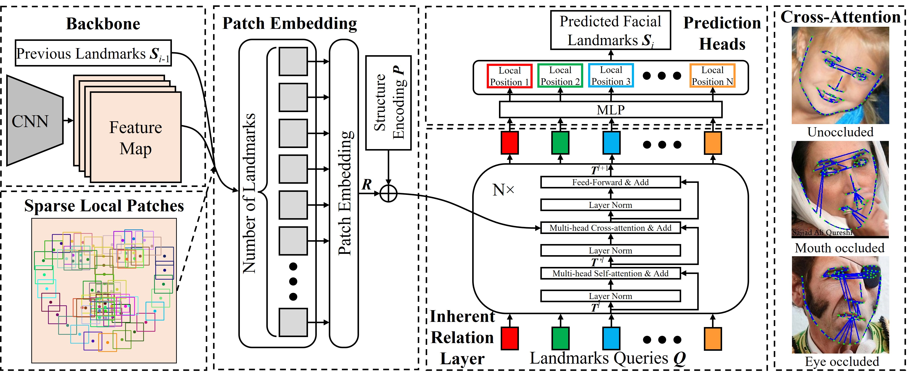

# Sparse Local Patch Transformer

PyTorch evaluation code and pretrained models for **SLPT** (Sparse Local Patch Transformer).



## Installation
#### Note: this released version was tested on Python3.8, Pytorch 1.10.2 and Windows 11.

Install python dependencies:
```
pip3 install -r requirements.txt
```

## Run Evaluation on WFLW dataset
1. Download and process WFLW dataset
    * Download WFLW dataset and annotation from [Here](https://wywu.github.io/projects/LAB/WFLW.html).
    * Unzip WFLW dataset and annotations and move files into ```./dataset``` directory. Your directory should look like this:
        ```
        SLPT
        └───Dataset
           │
           └───WFLW
              │
              └───WFLW_annotations
              │   └───list_98pt_rect_attr_train_test
              │   │
              │   └───list_98pt_test
              └───WFLW_images
                  └───0--Parade
                  │
                  └───...
        ```

2. Download pretrained model from Google Drive.
    * WFLW
   
    <table>
      <thead>
        <tr style="text-align: right;">
          <th></th>
          <td>Model Name</td>
          <td>NME (%)</td>
          <td>FR<sub>0.1</sub> (%)</td>
          <td>AUC<sub>0.1</sub></td>
          <td>download link</td>
        </tr>
      </thead>
      <tbody>
        <tr>
          <th>1</th>
          <td>SLPT-6-layers</td>
          <td>4.143</td>
          <td>2.760</td>
          <td>0.595</td>
          <td><a href="https://drive.google.com/file/d/1czNkcNN0RrL13CMSylSjSKpYbK9qzWk2/view?usp=sharing">download</a></td>
        </tr>
        <tr>
          <th>2</th>
          <td>SLPT-12-layers</td>
          <td>4.128</td>
          <td>2.720</td>
          <td>0.596</td>
          <td><a href="https://drive.google.com/file/d/1QRa5CCsGZEYBLdYfA-W8xjaJwGSPyQNC/view?usp=sharing">download</a></td>
        </tr>
      </tbody>
    </table>
   
    Put the model in ```./weight``` directory.

3. Test

    ```
    python test.py --checkpoint=<model_name>
    For example: python test.py --checkpoint=WFLW_6_layer.pth
    ```
    
    Note: if you want to use the model with 12 layers, you need to change ```_C.TRANSFORMER.NUM_DECODER``` for
    6 to 12 in ```./Config/default.py```.

## Video Demo

We also provide a video demo script.


1. Download [face detector](https://github.com/ShiqiYu/libfacedetection.train), copy the weight 
```yunet_final.pth``` to ```./Weight/Face_Detector/```
2. ```python Camera.py --video_source=<Video Path>```

## Citation
If you find this work or code is helpful in your research, please cite:
```
@inproceedings{SLPT,
  title={Sparse Local Patch Transformer for Robust Face Alignment and Landmarks},
  author={Jiahao Xia and Weiwei Qu and Wenjian Huang and Jianguo Zhang and Xi Wang and Min Xu},
  booktitle={CVPR},
  year={2022}
}
```

## License
SLPT is released under the GPL-2.0 license. Please see the [LICENSE](LICENSE) file for more information.

## Acknowledgments
   * This repository borrows or partially modifies the models from [HRNet](https://github.com/HRNet/HRNet-Facial-Landmark-Detection)
and [DETR](https://github.com/facebookresearch/detr)
   * The video demo employs the [libfacedetection](https://github.com/ShiqiYu/libfacedetection.train) as the face detector.
   * The test videos are provided by [DFEW](https://dfew-dataset.github.io/)
